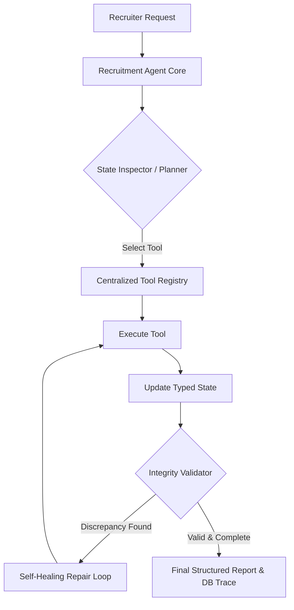
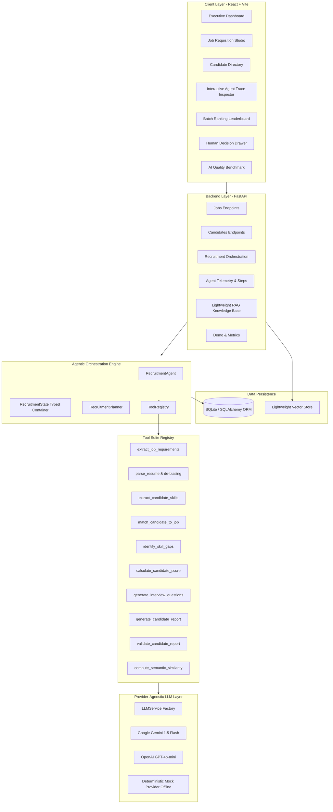

# AI Recruitment Agent — Autonomous Agentic Talent Intelligence

[](https://www.python.org/)
[](https://fastapi.tiangolo.com/)
[](https://vitejs.dev/)
[](https://www.sqlalchemy.org/)
[](https://docs.pytest.org/)
[](LICENSE)

> **Portfolio Project:** Demonstrating practical engineering competencies for a **Junior AI Engineer / GenAI / LLM** role:
> *Agentic AI Orchestration*, *Tool Calling*, *Structured Outputs (Pydantic)*, *Multi-Step Workflows*, *Evidence-Based Reasoning*, *Deterministic Scoring*, *Bias Mitigation*, *Lightweight RAG*, *REST APIs (FastAPI)*, and *Modern React Dashboard*.
>
> 🎬 **Demo Video:** [`Ai recruiter.mp4`](Ai%20recruiter.mp4) showcase recording included in repository.

---

## 1. Executive Summary

### The Problem
Traditional recruitment workflows require technical recruiters to manually review hundreds of resumes against complex job requisitions. This manual process is time-consuming, inconsistent, prone to cognitive bias, and frequently fails to evaluate the depth of technical claims or formulate targeted, personalized interview questions.

### The Solution
The **AI Recruitment Agent** is an autonomous decision-support system that orchestrates multi-step recruitment workflows using an agentic architecture:
- **Autonomous Tool Execution**: The agent reasons over a typed state (`RecruitmentState`), dynamically selecting and executing tools from a centralized registry.
- **Evidence-Based Grounding**: Eliminates unsupported claims by extracting verbatim resume citations proving candidate competencies.
- **Transparent Deterministic Scoring**: Mathematical weighted scoring (Skills 50%, Experience 20%, Education 10%, Preferred 10%, Projects 10%) that eliminates LLM score hallucinations.
- **Fairness & De-Biasing**: Automatically removes protected personal attributes (gender, age, marital status, religion) prior to skill matching.
- **Human-in-the-Loop Governance**: Separates AI recommendations from recruiter decisions (`Approve`, `Reject`, `Modify` with audit notes).

---

## 2. Agentic AI vs Conventional LLM Applications

Most generic GenAI applications rely on a naive single-prompt paradigm:
$$\text{User Request} \longrightarrow \text{Giant Prompt} \longrightarrow \text{LLM Output}$$

This approach suffers from hallucinations, opaque scoring, inability to verify facts, and no error recovery.

In contrast, this project implements a true **Agentic Multi-Step Workflow**:



The agent maintains state across steps, logs intermediate inputs/outputs to SQLite, enforces mathematical bounds, and operates within a controlled maximum step limit (`MAX_AGENT_STEPS = 12`).

---

## 3. System Architecture



---

## 4. Centralized Tool Registry

All agent actions are dispatched through a centralized `ToolRegistry` with strict Pydantic schemas:

| Tool Name | Input Schema | Output Schema | Purpose |
|---|---|---|---|
| `extract_job_requirements` | `job_description: str` | `JobRequirements` | Extracts core required skills, preferred tools, experience years, and education criteria. |
| `parse_resume` | `resume_text: str` | `CandidateProfile` | Parses candidate resume into typed model; applies de-biasing rules. |
| `extract_candidate_skills` | `CandidateProfile, raw_text` | `list[str]` | Normalizes abbreviations and aliases (`JS` $\rightarrow$ `JavaScript`, `Postgres` $\rightarrow$ `PostgreSQL`). |
| `match_candidate_to_job` | `JobRequirements, CandidateProfile` | `SkillMatchResult` | Evaluates requirements against candidate profile; extracts literal resume evidence snippets. |
| `identify_skill_gaps` | `JobRequirements, SkillMatchResult` | `SkillGapResult` | Categorizes gaps into **Critical**, **Moderate**, and **Minor** with recruiter rationale. |
| `calculate_candidate_score` | `JobRequirements, CandidateProfile, Match` | `ScoreBreakdown` | Computes transparent weighted score out of 100 with zero LLM hallucination. |
| `generate_interview_questions`| `JobRequirements, Profile, Match, Gaps` | `InterviewQuestionsResult` | Formulates personalized Technical, Project-based, Gap, and Behavioral interview questions. |
| `generate_candidate_report` | Multi-dimension payload | `CandidateReport` | Synthesizes findings into an executive report with strengths, weaknesses, and concerns. |
| `validate_candidate_report` | `CandidateReport, Requirements, Profile` | `ValidationResult` | Enforces score integrity, recommendation consistency, and evidence backing. |
| `compute_semantic_similarity`| `job_text, experience_texts` | `dict` | TF-IDF & cosine similarity for candidate experience alignment. |

---

## 5. Transparent Deterministic Scoring Model

To guarantee explainability and trust in enterprise hiring, numerical scores are computed mathematically rather than generated by an LLM prompt:

$$\text{Final Match Score} = S_{\text{skills}} + S_{\text{experience}} + S_{\text{education}} + S_{\text{preferred}} + S_{\text{projects}}$$

- **Core Skills Match (50%)**: Ratio of required skills matched (full match = 1.0, adjacent partial match = 0.5).
- **Experience Depth (20%)**: Ratio of candidate years vs required years (capped at 20 pts).
- **Education Alignment (10%)**: Degree level and major alignment.
- **Preferred Technologies (10%)**: Bonus technologies demonstrated.
- **Project Relevance (10%)**: Verification of hands-on project artifacts using the core stack.

### Recommendation Thresholds:
- $\ge 85$: **Strong Match**
- $70 - 84$: **Match**
- $50 - 69$: **Potential Match**
- $< 50$: **Weak Match**

---

## 6. AI Quality & Empirical Benchmark Metrics

The repository includes a curated evaluation benchmark (`backend/app/evaluation/`) testing the agent against ground-truth jobs and resumes. Real, un-fabricated metrics:

| Metric | Measured Score | Description |
|---|---|---|
| **Structured Output Validity** | **100.0%** | Pydantic validation rate across all 9 tool outputs. |
| **Skill Extraction Accuracy** | **100.0%** | Exact match of extracted normalized skills against ground truth. |
| **Tool Execution Success** | **100.0%** | Percentage of tool invocations completed without unhandled exceptions. |
| **Agent Completion Rate** | **100.0%** | Percentage of workflows successfully concluding within `MAX_AGENT_STEPS = 12`. |
| **Recommendation Consistency** | **Empirical** | Ground-truth alignment across strong, moderate, and weak applicant tiers. |

*Run live via UI on the **AI Quality Metrics** page or via API: `POST /api/evaluation/run-benchmark`.*

---

## 7. Interactive Agent Activity Trace

Every agent run persists a granular trace in SQLite:
- **Step Number**: Sequential workflow order.
- **Tool Name**: The exact tool dispatched from the registry.
- **Thought**: The reasoning generated by the planner justifying why this tool was chosen.
- **Tool Input**: JSON payload passed to the tool.
- **Tool Output**: Validated Pydantic output produced by the tool.
- **Execution Time**: Timing in milliseconds.
- **Status**: `SUCCESS` or `FAILED`.

*In the React frontend, navigate to **Agent Activity Trace** to inspect the live collapsible timeline.*

---

## 8. REST API Documentation

The backend is built with FastAPI. Interactive OpenAPI Swagger documentation is available out of the box at `http://localhost:8000/docs`.

### Key Endpoints:
- `GET /health` — Health check and provider telemetry.
- `POST /api/jobs` — Create job requisition with automatic AI requirement extraction.
- `GET /api/jobs` — List all jobs.
- `POST /api/candidates/upload` — Upload PDF/DOCX/TXT resume with de-biasing.
- `GET /api/candidates` — List candidates.
- `POST /api/recruitment/evaluate` — Run autonomous agent workflow for candidate vs job.
- `POST /api/recruitment/evaluate-batch` — Resilient batch candidate evaluation and ranking.
- `GET /api/recruitment/results/{id}` — Get complete evaluation report.
- `POST /api/recruitment/decide` — Submit human-in-the-loop recruiter decision (`Approve`, `Reject`, `Modify`).
- `GET /api/agent/runs` — List recent agent execution runs.
- `GET /api/agent/runs/{id}` — Get agent run with granular step-by-step trace.
- `GET /api/tools` — List all registered agent tools and schemas.
- `POST /api/knowledge/upload` — Upload hiring guidelines to lightweight RAG store.
- `POST /api/knowledge/query` — Semantic retrieval over guidelines.
- `GET /api/evaluation/metrics` — Retrieve latest AI benchmark metrics.
- `POST /api/demo/run` — 1-Click end-to-end demo execution.

---

## 9. Project Directory Structure

```
ai-recruitment-agent/
├── backend/
│   ├── app/
│   │   ├── main.py                     # FastAPI app, lifespan, CORS, routing
│   │   ├── config.py                   # Pydantic BaseSettings (.env, scoring weights)
│   │   ├── database.py                 # SQLAlchemy engine, session factory, init_db
│   │   ├── models/                     # SQLAlchemy ORM models (Job, Candidate, Evaluation, AgentStep...)
│   │   ├── schemas/                    # Pydantic validation schemas (API & tools)
│   │   ├── agents/                     # Agentic core
│   │   │   ├── state.py                # RecruitmentState typed container
│   │   │   ├── tool_registry.py        # Centralized ToolRegistry
│   │   │   ├── planner.py              # Tool selection & next action decision
│   │   │   └── recruitment_agent.py    # Agent loop with step limits & DB tracing
│   │   ├── tools/                      # Deterministic & LLM tools
│   │   │   ├── resume_parser.py        # PDF/DOCX extraction + de-biasing
│   │   │   ├── job_analyzer.py         # AI requirements extraction
│   │   │   ├── skill_extractor.py      # Alias normalization
│   │   │   ├── candidate_matcher.py    # Matching with evidence citations
│   │   │   ├── skill_gap_analyzer.py   # Critical/Moderate/Minor classification
│   │   │   ├── score_calculator.py     # Deterministic transparent scoring
│   │   │   ├── interview_generator.py  # Personalized interview questions
│   │   │   ├── report_generator.py     # Executive report assembly
│   │   │   ├── report_validator.py     # Self-healing integrity verification
│   │   │   └── semantic_search.py      # TF-IDF & cosine similarity
│   │   ├── llm/                        # Provider abstraction
│   │   │   ├── base.py                 # BaseLLMProvider interface
│   │   │   ├── gemini.py               # Google Gemini provider
│   │   │   ├── openai.py               # OpenAI provider
│   │   │   ├── mock_llm.py             # Deterministic Mock LLM (zero-key offline mode)
│   │   │   └── service.py              # LLMService factory with retry & backoff
│   │   ├── rag/                        # Lightweight RAG
│   │   │   ├── document_processor.py   # Paragraph-aware chunking
│   │   │   └── vector_store.py         # In-memory TF-IDF vector store
│   │   ├── prompts/                    # Versioned, maintainable prompt templates
│   │   ├── evaluation/                 # Ground-truth benchmark suite
│   │   └── api/                        # REST API routers
│   ├── tests/                          # Comprehensive pytest suite (13 tests)
│   ├── requirements.txt
│   ├── pytest.ini
│   └── .env.example
├── frontend/                           # React + Vite application
│   ├── src/
│   │   ├── api/client.js               # REST API client
│   │   ├── components/                 # ScoreBadge, ScoreBreakdown, AgentTraceTimeline, HumanDecisionModal...
│   │   ├── pages/                      # Dashboard, Jobs, Candidates, Evaluation, Batch, AgentRuns, Benchmark, Demo
│   │   ├── App.jsx                     # Main layout & navigation
│   │   └── index.css                   # Custom design system tokens & glassmorphic styles
│   ├── package.json
│   └── vite.config.js                  # Backend proxy configuration
├── data/
│   ├── sample_jobs/                    # Realistic test job requisitions
│   ├── sample_resumes/                 # Realistic test resumes (Alice, Bob, Charlie)
│   └── sample_knowledge/              # Sample hiring policy & guidelines
├── docs/
│   ├── architecture.md                 # Detailed architectural specifications
│   └── agent-workflow.md               # Step-by-step state transition graph
└── README.md
```

---

## 10. Quickstart & Installation

### Prerequisites
- Python 3.11+
- Node.js 18+ and npm

### 1. Clone & Setup Backend
```bash
# Navigate to backend
cd backend

# Install dependencies
pip install -r requirements.txt

# Configure environment (optional: works out of the box with offline Mock provider)
cp .env.example .env

# Run automated tests
pytest tests

# Start FastAPI backend server
python -m uvicorn app.main:app --reload --port 8000
```
*Backend runs at `http://localhost:8000`. Swagger docs at `http://localhost:8000/docs`.*

### 2. Setup Frontend
```bash
# In another terminal, navigate to frontend
cd frontend

# Install dependencies
npm install

# Start Vite dev server
npm run dev
```
*Frontend runs at `http://localhost:5173`.*

---

## 11. 1-Click Interactive Demo

1. Open `http://localhost:5173` in your browser.
2. Click **1-Click Demo Showcase** in the sidebar (or top bar).
3. Click **Run Live 1-Click Agent Demo**.
4. The system automatically:
   - Seeds sample job requisitions and candidate resumes.
   - Dispatches the **Recruitment Agent**.
   - Executes all 9 tools sequentially.
   - Displays the **Deterministic Score Breakdown**, **Evidence Citations**, **Personalized Interview Questions**, and **Interactive Step-by-Step Agent Trace**!

---

## 12. Human-in-the-Loop Workflow

1. Navigate to **Candidate Evaluation**.
2. Click **✓ Recruiter Review**.
3. Choose:
   - **Approve AI Recommendation**
   - **Reject AI Recommendation**
   - **Override / Edit Recommendation** (select modified tier)
4. Enter recruiter evaluation rationale and click **Finalize Recruiter Decision**.
5. The decision is permanently stored in SQLite alongside the audit trail.

---

## 13. Limitations & Future Work

1. **OCR Support**: Current resume parsing utilizes PyMuPDF and python-docx. Scanned images without selectable text require an OCR pipeline (e.g. Tesseract or vision LLMs).
2. **PostgreSQL Production Deployment**: Configured by changing `DATABASE_URL` in `.env` to PostgreSQL.
3. **Multi-Agent Teams**: Future architecture can decouple the system into specialized sub-agents: *Sourcing Agent*, *Technical Screening Agent*, and *Compliance Agent*.

---

## 14. License

This project is licensed under the MIT License.
