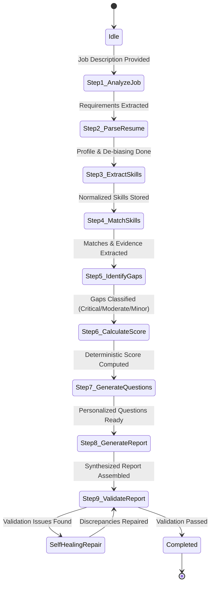

# Agent Workflow and Tool Execution Pipeline

This document describes the step-by-step state transition graph and tool-calling execution lifecycle executed by the **RecruitmentAgent**.

## 1. State Transition Lifecycle

---

## 2. Granular Step Explanations

### Step 1 — `extract_job_requirements`
- **Purpose**: Parses unstructured job description text.
- **Output Schema**: `JobRequirements` (job title, required core skills, preferred skills, experience years, education, responsibilities, keywords).

### Step 2 — `parse_resume`
- **Purpose**: Extracts structured applicant profiles from PDF, DOCX, or TXT. Applies regex-based de-biasing to strip protected personal attributes.
- **Output Schema**: `CandidateProfile` (name, email, phone, summary, education, experience, projects, certifications, total years of experience).

### Step 3 — `extract_candidate_skills`
- **Purpose**: Normalizes skill variations using alias resolution (e.g., `JS` $\rightarrow$ `JavaScript`, `Postgres` $\rightarrow$ `PostgreSQL`, `ML` $\rightarrow$ `Machine Learning`).

### Step 4 — `match_candidate_to_job`
- **Purpose**: Evaluates candidate profile against job requirements.
- **Evidence-Based Reasoning**: Extracts literal verbatim quotes from work experience or projects proving candidate claims.

### Step 5 — `identify_skill_gaps`
- **Purpose**: Categorizes missing and partial competencies:
  - **Critical**: Core required skills absent.
  - **Moderate**: Adjacent experience exists, but lacks hands-on depth.
  - **Minor**: Preferred nice-to-have skills absent.

### Step 6 — `calculate_candidate_score`
- **Purpose**: Calculates transparent weighted score (0 to 100).
- **Thresholds**:
  - $\ge 85$: Strong Match
  - $70 - 84$: Match
  - $50 - 69$: Potential Match
  - $< 50$: Weak Match

### Step 7 — `generate_interview_questions`
- **Purpose**: Formulates personalized Technical, Project-based, Skill-gap, and Behavioral interview questions with expected answer criteria.

### Step 8 — `generate_candidate_report`
- **Purpose**: Synthesizes all collected dimensions into an executive candidate report.

### Step 9 — `validate_candidate_report`
- **Purpose**: Verifies score sums, recommendation thresholds, and evidence integrity. Discrepancies trigger automatic self-healing.
