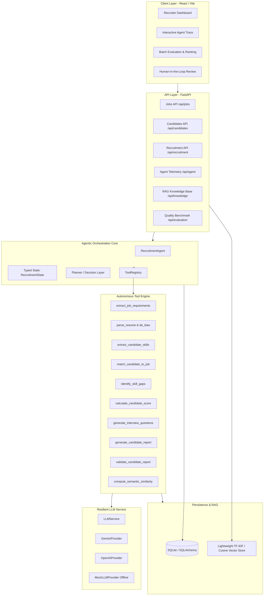

# System Architecture Specification: AI Recruitment Agent

## 1. High-Level Architecture Overview

The **AI Recruitment Agent** is a multi-tier decision-support system designed to automate candidate evaluation while keeping a human recruiter in the loop.

---

## 2. Core Architectural Principles

### A. Agentic Tool Calling vs Prompt Chaining
Unlike conventional conversational chatbots that process input through a single giant prompt, this system implements a goal-driven loop:
1. **Perception**: Evaluates the current `RecruitmentState`.
2. **Planning**: Decides which tool is necessary based on missing or incomplete intermediate state variables.
3. **Action**: Executes the selected tool via the centralized `ToolRegistry`.
4. **Validation & Self-Healing**: Validates the output against rule-based constraints (e.g., verifying mathematical score consistency and evidence alignment). Discrepancies trigger a self-correction repair loop.
5. **Traceability**: Every step records its thought, input arguments, output payload, status, and duration in `AgentStep` database records.

### B. Transparent Deterministic Scoring
To prevent LLM score hallucinations, numerical evaluation scores are calculated mathematically by `calculate_candidate_score`:
- **Core Skills Match**: 50%
- **Experience Depth**: 20%
- **Education Alignment**: 10%
- **Preferred Skills**: 10%
- **Project Relevance**: 10%
- **Total**: 100%

### C. Bias Mitigation & Fairness
The system automatically sanitizes candidate resumes prior to skill extraction and matching by removing sensitive personal attributes:
- Gender / Sex
- Marital Status
- Religion / Faith
- Date of Birth / Age
- Nationality / Citizenship
- Race / Ethnicity
Evaluation is anchored strictly on verifiable code achievements, technical skills, and work history.

### D. Human-in-the-Loop Governance
The system distinguishes between an **AI Recommendation** and a **Recruiter Decision**. The recruiter can:
- `Approve`: Validate AI recommendation.
- `Reject`: Overturn recommendation.
- `Modify`: Adjust recommendation tier (e.g. from Potential Match to Match) and record explanatory notes.
